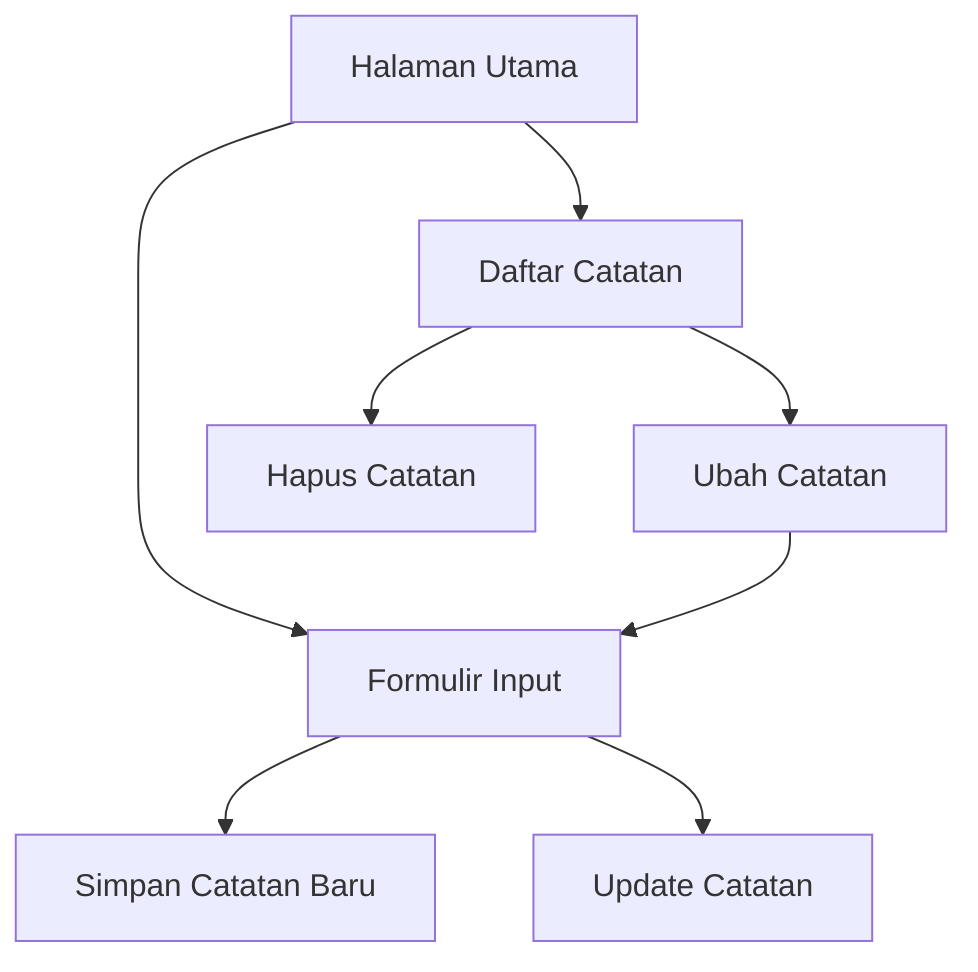

# Dokumen Persyaratan Produk - Aplikasi Buku Harian

## 1. Product Overview
Aplikasi Buku Harian adalah aplikasi web satu halaman yang memungkinkan pengguna untuk membuat, membaca, memperbarui, dan menghapus catatan harian mereka.
Aplikasi ini dirancang untuk memberikan pengalaman yang sederhana dan intuitif bagi pengguna yang ingin mencatat aktivitas harian mereka dengan antarmuka yang bersih dan modern.
Target aplikasi ini adalah untuk menyediakan solusi digital yang mudah digunakan untuk pencatatan harian pribadi.

## 2. Core Features

### 2.1 User Roles
Tidak ada pembedaan peran pengguna dalam aplikasi ini. Semua pengguna memiliki akses penuh ke semua fitur aplikasi.

### 2.2 Feature Module
Aplikasi buku harian terdiri dari satu halaman utama dengan komponen berikut:
1. **Halaman Utama**: formulir input catatan, daftar catatan harian, operasi CRUD untuk setiap catatan.

### 2.3 Page Details
| Page Name | Module Name | Feature description |
|-----------|-------------|---------------------|
| Halaman Utama | Formulir Input | Input judul dan isi catatan, tombol simpan untuk membuat atau memperbarui catatan |
| Halaman Utama | Daftar Catatan | Menampilkan semua catatan dalam format kartu, setiap kartu menampilkan judul dan isi |
| Halaman Utama | Operasi Catatan | Tombol ubah untuk mengedit catatan, tombol hapus untuk menghapus catatan |
| Halaman Utama | Data Management | Fetch data dari API saat aplikasi dimuat, POST untuk catatan baru, PUT untuk update, DELETE untuk hapus |

## 3. Core Process
Pengguna dapat langsung menggunakan aplikasi tanpa registrasi atau login. Alur utama penggunaan:
1. Pengguna membuka aplikasi dan melihat formulir kosong di bagian atas
2. Pengguna melihat daftar catatan yang sudah ada (jika ada) di bagian bawah
3. Untuk membuat catatan baru: pengguna mengisi formulir dan klik "Simpan Catatan"
4. Untuk mengedit catatan: pengguna klik tombol "Ubah" pada catatan, formulir akan terisi otomatis, lalu klik "Simpan Catatan"
5. Untuk menghapus catatan: pengguna klik tombol "Hapus" pada catatan yang ingin dihapus

## 4. User Interface Design
### 4.1 Design Style
- **Warna Utama**: Blue-500 (#3B82F6) untuk tombol utama, Gray-100 (#F3F4F6) untuk background
- **Warna Sekunder**: Red-500 (#EF4444) untuk tombol hapus, Green-500 (#10B981) untuk tombol simpan
- **Gaya Tombol**: Rounded corners (rounded-lg), shadow effects untuk depth
- **Font**: Default system font dengan ukuran text-sm untuk body, text-lg untuk judul
- **Layout**: Card-based layout dengan spacing yang konsisten, container terpusat dengan max-width
- **Icon**: Gunakan emoji sederhana atau Heroicons untuk konsistensi

### 4.2 Page Design Overview
| Page Name | Module Name | UI Elements |
|-----------|-------------|-------------|
| Halaman Utama | Formulir Input | Container putih dengan shadow, input fields dengan border gray, tombol biru dengan hover effects |
| Halaman Utama | Daftar Catatan | Grid layout dengan gap, setiap kartu memiliki background putih, shadow, dan rounded corners |
| Halaman Utama | Operasi Catatan | Tombol kecil dengan warna berbeda (biru untuk edit, merah untuk hapus), positioned di bagian bawah kartu |

### 4.3 Responsiveness
Aplikasi dirancang mobile-first dengan responsive design. Layout akan menyesuaikan dari 1 kolom di mobile hingga 2-3 kolom di desktop untuk daftar catatan. Touch interaction dioptimalkan untuk penggunaan mobile.