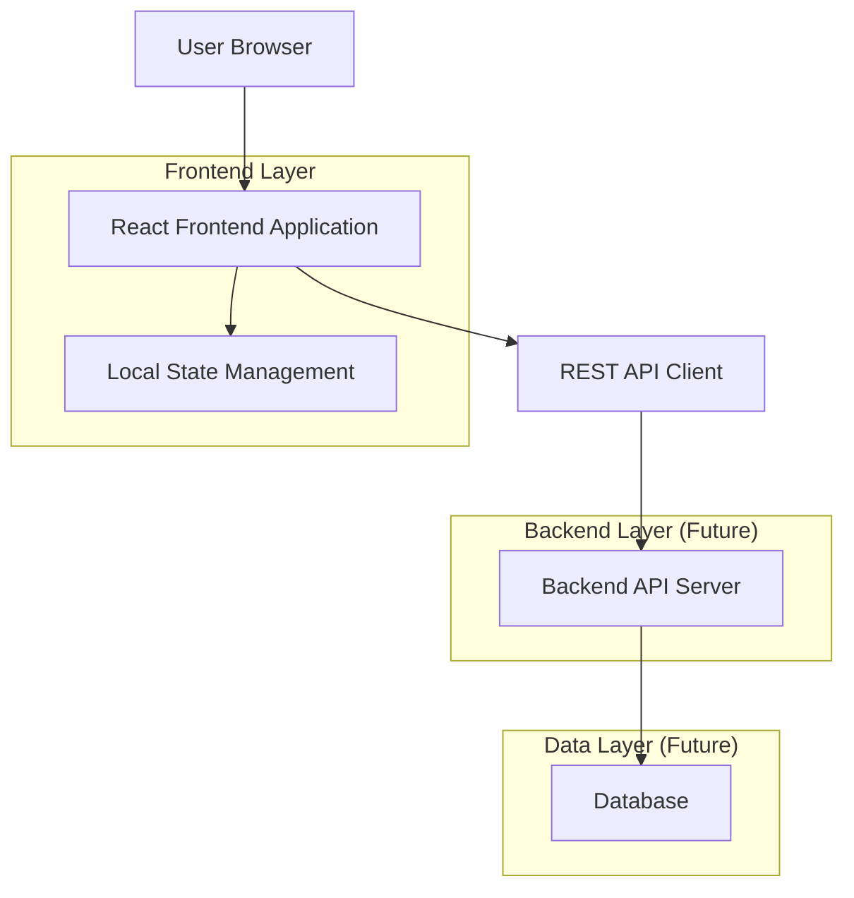
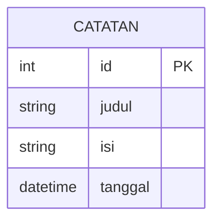

# Dokumen Arsitektur Teknis - Aplikasi Buku Harian

## 1. Architecture Design



## 2. Technology Description

* Frontend: React\@18 + Vite\@5 + Tailwind CSS\@3

* State Management: React Hooks (useState, useEffect)

* HTTP Client: Fetch API (native browser)

* Backend: None (akan menggunakan dummy data, siap untuk integrasi API)

## 3. Route Definitions

| Route | Purpose                                                               |
| ----- | --------------------------------------------------------------------- |
| /     | Halaman utama aplikasi buku harian dengan formulir dan daftar catatan |

## 4. API Definitions

### 4.1 Core API

Catatan harian related

```
GET /catatan
```

Mengambil semua catatan harian

Response:

| Param Name | Param Type | Description                    |
| ---------- | ---------- | ------------------------------ |
| id         | number     | ID unik catatan                |
| judul      | string     | Judul catatan                  |
| isi        | string     | Isi/konten catatan             |
| tanggal    | string     | Tanggal pembuatan (ISO format) |

Example Response:

```json
[
  {
    "id": 1,
    "judul": "Hari Pertama Kerja",
    "isi": "Hari ini adalah hari pertama saya bekerja di perusahaan baru...",
    "tanggal": "2024-01-15T10:30:00Z"
  }
]
```

```
POST /catatan
```

Membuat catatan baru

Request:

| Param Name | Param Type | isRequired | Description        |
| ---------- | ---------- | ---------- | ------------------ |
| judul      | string     | true       | Judul catatan      |
| isi        | string     | true       | Isi/konten catatan |

Example Request:

```json
{
  "judul": "Liburan ke Bali",
  "isi": "Hari ini saya pergi liburan ke Bali bersama keluarga..."
}
```

```
PUT /catatan/:id
```

Memperbarui catatan yang ada

Request:

| Param Name | Param Type | isRequired | Description                        |
| ---------- | ---------- | ---------- | ---------------------------------- |
| judul      | string     | true       | Judul catatan yang diperbarui      |
| isi        | string     | true       | Isi/konten catatan yang diperbarui |

```
DELETE /catatan/:id
```

Menghapus catatan berdasarkan ID

Response:

| Param Name | Param Type | Description        |
| ---------- | ---------- | ------------------ |
| success    | boolean    | Status penghapusan |
| message    | string     | Pesan konfirmasi   |

## 5. Data Model

### 5.1 Data Model Definition



### 5.2 Data Definition Language

Catatan Table (catatan)

```sql
-- create table
CREATE TABLE catatan (
    id SERIAL PRIMARY KEY,
    judul VARCHAR(255) NOT NULL,
    isi TEXT NOT NULL,
    tanggal TIMESTAMP WITH TIME ZONE DEFAULT NOW()
);

-- create index
CREATE INDEX idx_catatan_tanggal ON catatan(tanggal DESC);

-- init data
INSERT INTO catatan (judul, isi) VALUES 
('Hari Pertama Kerja', 'Hari ini adalah hari pertama saya bekerja di perusahaan baru. Semua orang sangat ramah dan membantu.'),
('Liburan ke Pantai', 'Menghabiskan waktu di pantai bersama keluarga. Cuaca sangat cerah dan menyenangkan.'),
('Belajar React', 'Hari ini saya mempelajari React Hooks dan cara menggunakan useState serta useEffect.');
```

